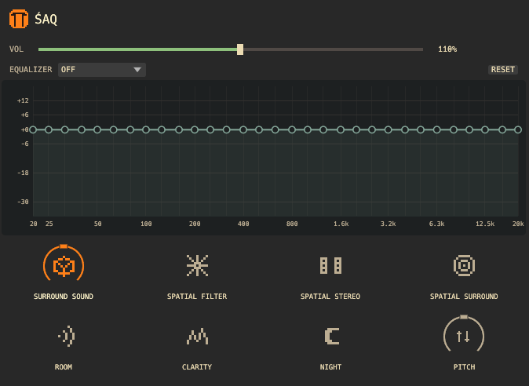

# Śaq

A real-time easy to use audio enhancer for Linux



Checkout the cross-platform web version here which supports cross-tab capture and simple audio playback: https://mtvare6.github.io/saqol/

The cross-tab capture doesn't work on Firefox, or Qt-based browsers and probably more.
At least Chrom(ium|e) works.

### Libraries

PipeWire devel headers for your distribution.

### Running

```sh
# daemon
cargo run --release

# gui client
cargo run --bin saq --release

# cli client
cargo run --bin saqctl --release -- pitch enable
```

### Installing

```sh
./res/install.sh
```

This installs the systemd service and starts the daemon. Start the GUI with `saq` to play around with the settings.

### Nix

```sh
nix build
nix develop
```

```sh
nix run          # gui
nix run .#daemon # daemon
```

### Roadmap

- [x] EQ and presets
  - [x] Presets
  - [x] [Controls](https://signalsmith-audio.co.uk/writing/2021/monotonic-smooth-interpolation/) to create custom preset
- [ ] UX
  - [x] Persistence
  - [ ] Non-RT features
  - [x] daemon-mode and IPC support
  - [ ] Configuration files
  - [ ] Detailed IPC error handling
  - [x] Better command-line parsing
  - [ ] Colors
- [ ] PipeWire features
  - [ ] n.1 input (n > 2)
  - [ ] Variable sample rate
- [ ] Desktop integration
  - [x] Init system integration
  - [ ] Package manager support
      - [x] Arch
      - [x] Nix
      - [ ] Debian
  - [ ] Desktop environment-like projects

### License

The source code and documentation are licensed under the Mozilla Public License 2.0. See [LICENSE](LICENSE).
